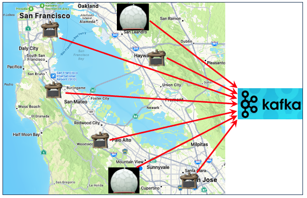
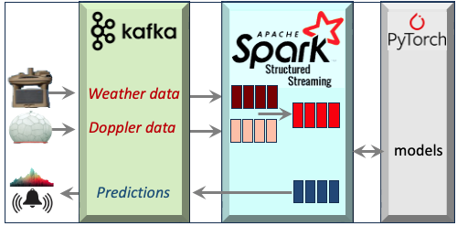
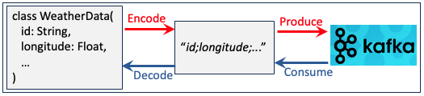

### streaming Patrick Nicolas Last update 01.03.2024.

The pipeline packages contains implementation for 
- Evaluation of Apache Kafka and Spark streaming functionality in Scala with application to weather 
tracking and storm forecast (**org.pipeline.streams**)
- Batch cleansing of datasets (**org.pipeline.batch**)
- NoSQ/MongoDB client cod (**org.pipeline.nosql**)
- Optimization of Spark configuration using Genetic Algorithm (**org.pipeline.ga**)

## References
- [Open Source Lambda Architecture for Deep Learning](http://patricknicolas.blogspot.com/2021/06/open-source-lambda-architecture-for.html)
- [Boost real-time processing with Spark Structured Streaming](https://patricknicolas.blogspot.com/2023/11/boost-real-time-processing-with-spark.html)
- [Tracking storms with Kafka/Spark streaming](https://patricknicolas.blogspot.com/2023/11/tracking-storms-with-kafkaspark.html)
- [Optimize Apache Spark with Genetic Algorithm](https://patricknicolas.blogspot.com/2024/01/optimize-spark-with-genetic-algorithm.html)
- [Implement non-blocking MongoDB client in Scala](https://patricknicolas.blogspot.com/2023/09/parameterized-non-blocking-scala-client.html)

# Setup
## Environment
| Library      | Version |
|:-------------|:--------|
| Scala        | 2.12.15 |
| Apache Spark | 3.4.0   |
| Apache Kafka | 3.4.0   |
| Jackson ser  | 2.13.1  |
| Kubernetes   | 16.0.0  |

## Updates
| Date       | Version |
|:-----------|:--------|
| 01.20.2023 | 0.0.1   |
| 06.03.2023 | 0.0.2   |
| 08.12.2023 | 0.0.3   |
| 10.30.2023 | 0.0.4   |

## Scala packages
within the package org.pipeline

| Package                | Description                                                              |
|:-----------------------|:-------------------------------------------------------------------------|
| util                   | Utilities classes                                                        |
| batch	                 | Batch processing for data cleansing
| streams		 | Clasess for Kafka and Spark streaming application
| streams.kafka          | Classes related to Kafka service management                              |
| streams.kafka.prodcons | Classes related to Kafka producer/consumer                               |
| streams.kafka.streams  | Classes related to Kafka streaming                                       |
| streams.spark          | Classes related to spark datasets and structured streaming               |
| streams.spark.etl      | Spark structured streaming for generic ETL                               |
| streams.spark.weatherTracking | KafkaConnect & Spark structured streaming application for tracking weather |
| noseql                 | Classes related to MongoDB client |
| ga                     | Genetic algorithm implementation for optimizing Spark configuration. |

## Deployment
From dockerfile for local deployment for a root directory 'myhome':    
- Linux X64: **docker --build-args jdk_target=linux_x64 home=myhome build -t streaming**         
- MacOS X64: **docker --build-args jdk_target=macos_x64 home=myhome build -t streaming**
- MacOS ARM: **docker --build-args jdk_target=macos_aarch64 home=myhome build -t streaming**

# Streaming

## Kafka 

### Launch script

<pre>
zookeeper-server-stop
kafka-server-stop
sleep 2
zookeeper-server-start $KAFKA_ROOT/kafka/config/zookeeper.properties &
sleep 1
ps -ef | grep zookeeper
kafka-server-start $KAFKA_ROOT/kafka/config/server.properties &
sleep 1
ps -ef | grep kafka
</pre>

## Spark structured streaming 

### Libraries - pom.xml
<pre>
   Spark version: <spark.version>3.4.0</spark.version>
   <groupId>org.apache.spark</groupId>
   <artifactId>spark-core_2.12</artifactId>

   <groupId>org.apache.spark</groupId>
   <artifactId>spark-sql_2.12</artifactId>

   <groupId>org.apache.spark</groupId>
   <artifactId>spark-streaming_2.12</artifactId>

   <groupId>org.apache.spark</groupId>
   <artifactId>spark-hadoop-cloud_2.12</artifactId>

   <groupId>org.apache.spark</groupId>
   <artifactId>spark-streaming-kafka-0-10_2.12</artifactId>
</pre>

### Command lines application
For testing purpose, we deploy Apache Kafka on a local host listening to the default port 9092. 
Here are some useful commands:

To list topics for local deployment of Kafka service
<pre>
kafka-topics --bootstrap-server localhost:9092 --list
</pre>

To create a new topic (i.e. doppler) for local deployment of Kafka service
<pre>
kafka-topics
--bootstrap-server localhost:9092
--topic doppler
--create
--replication-factor 1
--partitions 2
</pre>

To list messages for a given topic (i.e., weather) for local deployment of Kafka service
<pre>
kafka-console-consumer
--topic weather
--from-beginning
--bootstrap-server localhost:9092
</pre>

### Use case: Storm forecast
#### Overview
This use case involves gathering data from weather stations and Doppler radars, then merging 
these data sources based on location and time stamps. After consolidation, the unified data is sent to a model that forecasts potentially hazardous storms or tornadoes. The resulting predictions are then relayed back to the relevant authorities (such as emergency personnel, newsrooms, law enforcement, etc.) through Kafka.
Implemented in *spark/weatherTracking* Package.

#### Architecture
he monitoring streaming pipeline is structured into three phases:
Kafka queue.
Spark's distributed structured streams.
A variety of storm and tornado prediction models, developed using the PyTorch library and accessible via REST API.

Data gathered from weather stations and Doppler radars is fed into the Spark engine, where both streams are combined and harmonized based on location and timestamp. This unified dataset is then employed for training the model. During the inference phase, predictions are streamed back to Kafka.

Illustration of encoding/decoding weather tracking data:

# Genetic Algorithm
## Overview
Consider the innovative approach of a genetic algorithm, a search heuristic inspired by Charles Darwin's theory of evolution. This method applies the concepts of natural selection to efficiently determine the best configuration for your Apache Spark application. It aims to achieve an ideal balance between minimizing production costs and maximizing customer satisfaction.

The goal is to identify the best settings for Apache Spark configuration parameters that minimize deployment expenses while ensuring high-quality service, as indicated by reduced latency. This goal will be converted into a fitness function during the genetic algorithm's development.
A Spark configuration is defined as
<pre>
case class SparkConfiguration(sparkParameters: Seq[ParameterDefinition])

case class ParameterDefinition(
  key: String,
  value: String,
  isDynamic: Boolean,
  paramType: String,
  range: Seq[String] = Seq.empty[String]
)
</pre>

## Implementation
### Encoding
We establish the genetic encoder responsible for transforming genes to and from configuration parameters. 
The GAEncoder trait encompasses two characteristics:
- encodingLength: The number of bits required to represent a parameter's value.
- range: A sequence of valid, adjustable values applicable to this parameter.
The sequence of bits, termed BitsRepr, is defined as a Seq[Int] consisting of either 0 or 1 values.

There are three primary methods:
- rand: This method initializes a parameter value randomly.
- apply: This function encodes a parameter's value into a sequence of bits.
- unapply: This procedure decodes a bit sequence back into a parameter value.

<pre>
traitGAEncoder[T]{
  val encodingLength: Int
  val range: Seq[T]

  def rand: T
  def apply(t: T): BitsRepr
  def unapply(bitsRepr: BitsRepr): T
}
</pre>

### Gene
A Gene serves as the genetic representation of a configuration parameter. Consequently, its constructor requires the following:
- The name of the parameter, referred to as 'id'.
- The value of the parameter denoted as 't'.
- An encoder, gaEncoder that corresponds to the parameter's type.
To minimize its memory usage and facilitate direct bit manipulation, the sequence of bits, 'bitsSequence', is transformed into a Java BitSet.
<pre>
class Gene[T : Ordering] (id: String, t: T, gaEncoder: GAEncoder[T]) {
  // Encoding as a  sequence of {0, 1}
  private[this] val bitsSequence: BitsRepr = gaEncoder(t)

  // Encoding as Bit set
  private[this] val encoded: util.BitSet = {
    val bs =  new java.util.BitSet(gaEncoder.encodingLength)
    bitsSequence.indices.foreach(index => bs.set(index, bitsSequence(index) == 1))
    bs
  }

  def mutate(mutationProb: Double): Gene[T] = {
    (new MutationOp{
      override val mutationProbThreshold: Double = mutationProb
    }).mutate(this)
  }
</pre>

### Chromosome
A chromosome symbolizes a Spark configuration. Assuming the configuration parameters are of two types (namely Float and Int), the constructor accepts two parameters:
- features1: This represents the features/genes of one type.
- features2: This encompasses the features/genes of the other type.

Additionally, the attribute 'fitness' accumulates the score for the specified set of configuration parameters.

<pre>
class Chromosome[T : Ordering, U : Ordering](
  features1: Seq[Gene[T]],
  features2: Seq[Gene[U]]){

  var fitness: Double = -1.0

  def xOver(
    otherChromosome: Chromosome[T, U],
    xOverThreshold: Double
  ): (Chromosome[T, U], Chromosome[T, U]) = 
     (new XOverOp{
        override val xOverProbThreshold: Double = xOverThreshold
     }).xOver(this, otherChromosome)
  
  def mutate(mutationProb: Double): Chromosome[T, U] = {
    (new MutationOp{
      override val mutationProbThreshold: Double = mutationProb
    }).xOver(this)
  }
}
</pre>
The process of encoding a Spark configuration is carried out by the 'encode' method. This involves purifying the parameter values from any units (denoted as 'cleansedParamValue'). The type of the configuration parameter, referred to as 'paramType', is utilized to create the encoder and gene of the suitable type.

<pre>
def encode(sparkConfig: SparkConfiguration): Chromosome[Int, Float] = {
   val floatGenes = ListBuffer[Gene[Float]]()
   val intGenes = ListBuffer[Gene[Int]]()

   sparkConfig.sparkParameters.foreach(paramValue => {
      val value = paramValue.value
      val cleansedParamValue: String =
         if (!value.last.isDigit) value.substring(0, value.length - 1)
         else value

      paramValue.paramType match {
         case "Int" =>
            val encoder = new GAEncoderInt(encodingLength = 6, paramValue.range.map(_.toInt))
            val intGene = Gene[Int](paramValue.key, cleansedParamValue.toInt, encoder)
            intGenes.append(intGene)
</pre>

## Mutation
The mutation process of a chromosome occurs in two stages:
The genetic algorithm chooses a gene for mutation if the mutation probability falls below a specified threshold.
A bit within the bit sequence is randomly selected and flipped based on a certain probability.

The mutation operation initiates when a randomly generated value between [0, 1] remains below a specified low mutation rate, termed 'mutationProbThreshold'.

Afterward, the mutated bit sequence is decoded into a value of type T. This decoded value must fall within the range of valid values predetermined for this configuration parameter, a process known as 'createValidMutation'.
<pre>
trait MutationOp {
self =>
  protected[this] val mutationProbThreshold: Double
  private[this] val rand = new Random(42L)

   // Mutation of a gene - Step 2
  def mutate[T: Ordering](gene: Gene[T]): Gene[T] = 
     if(rand.nextDouble < mutationProbThreshold) {
         val newValue = createValidMutation(gene, implicitly[Ordering[T]])
         Gene[T](gene.getId, newValue, gene.getEncoder)
      }
      else
         gene

   
  def mutate[T: Ordering, U: Ordering](chromosomes: Seq[Chromosome[T,U]]): Seq[Chromosome[T,U]] = 
    chromosomes.map(mutate(_))      

  // Mutation of a chromosome - Step 1
  def mutate[T : Ordering, U: Ordering](chromosome: Chromosome[T, U]): Chromosome[TU]
</pre>

### Crossover
The crossover process involves dividing two 'parent' chromosomes and then merging their upper and lower segments to create two new 'offspring' chromosomes.

<pre>
def xover[T : Ordering, U : Ordering](
  chromosome1: Chromosome[T, U],
  chromosome2: Chromosome[T, U]
): (Chromosome[T, U], Chromosome[T, U]) = {

  if(rand.nextDouble < xOverProbThreshold) {
    val xOverIndex = (chromosome1.size()*Random.nextDouble).toInt
    val features1Len = chromosome1.getFeatures1.length

      // The cross-over cut-off is done within the first set of genes, preserving
      // the second set of genes ..
    if(xOverIndex < features1Len)
      xOverFirstFeatures(chromosome1, chromosome2)
        // Otherwise the cross-over is performed within the second set of genes
    else
       xOverSecondFeatures(chromosome1, chromosome2)
  }
  else
    (chromosome1, chromosome2)
}
</pre>

### Selection chromosomes for crossover

Several approaches exist for choosing candidate chromosomes for crossover [ref 5]. Three frequently used strategies include:
- midPoint: This method involves dividing the population of ranked chromosomes into two groups and then combining these groups.
- pairing: This strategy selects chromosome pairs that are contiguous in terms of their ranking.
- random: This approach randomly selects two candidate chromosomes.

